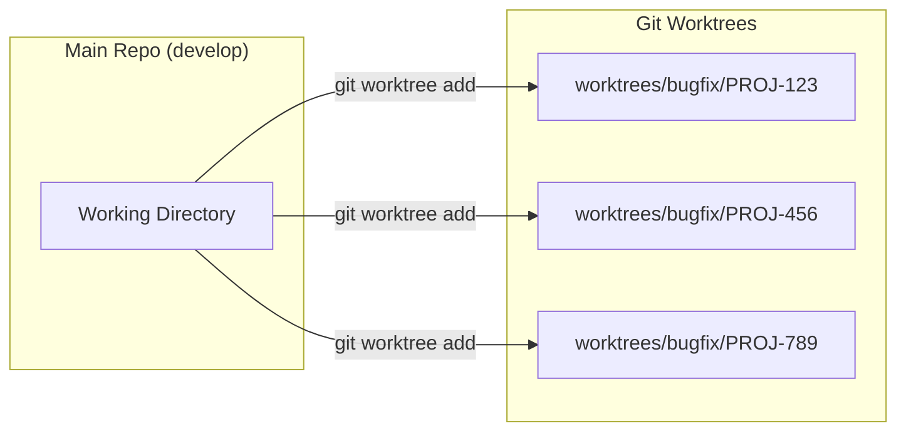
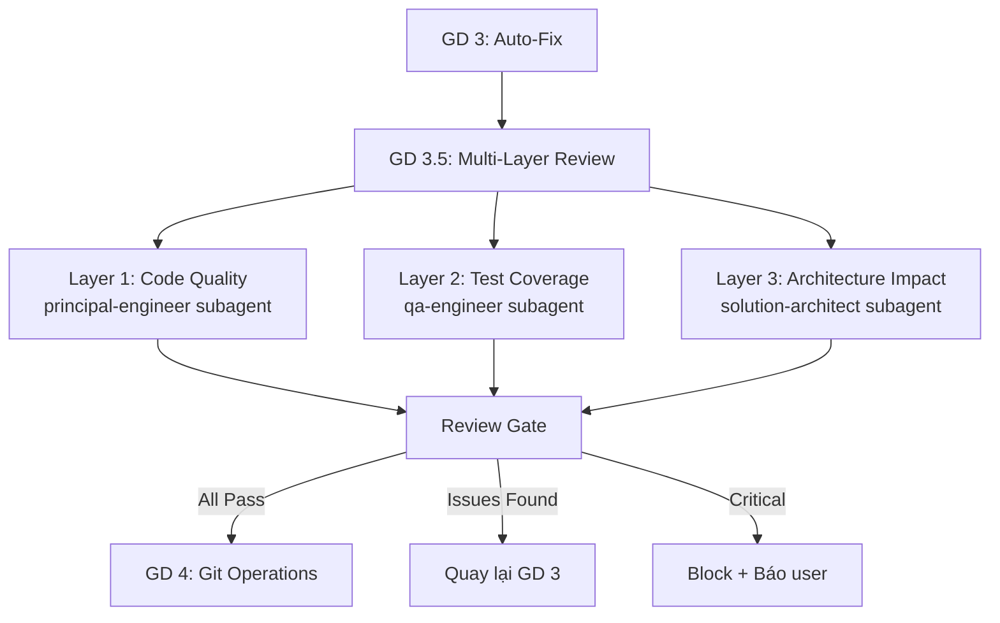
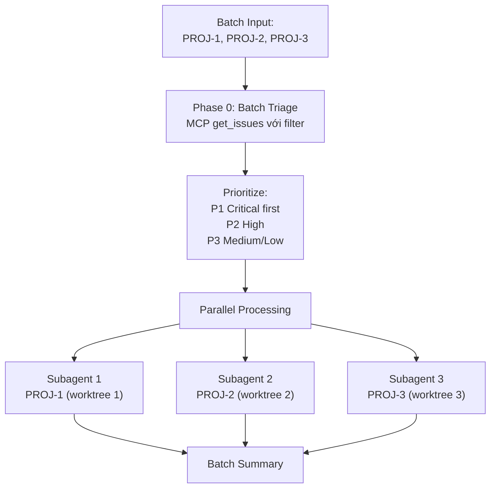
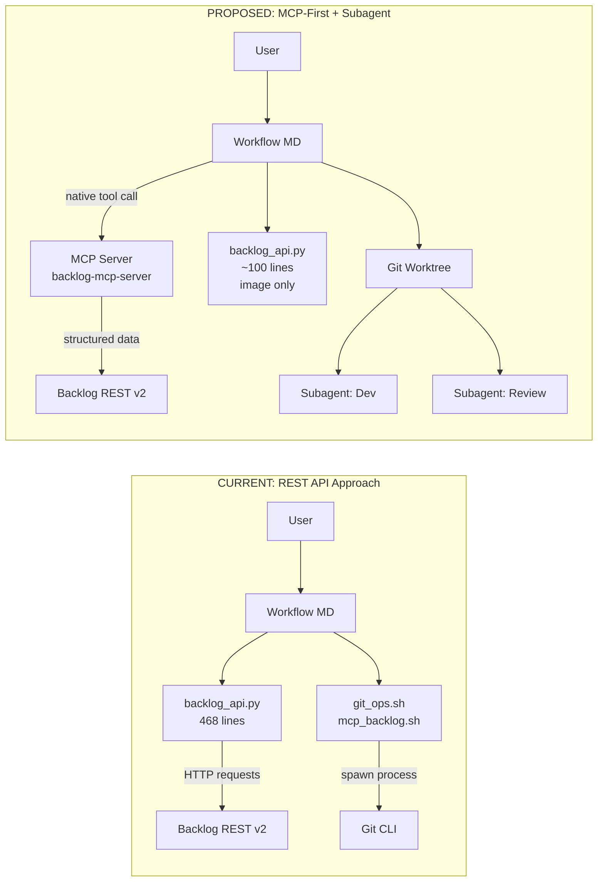
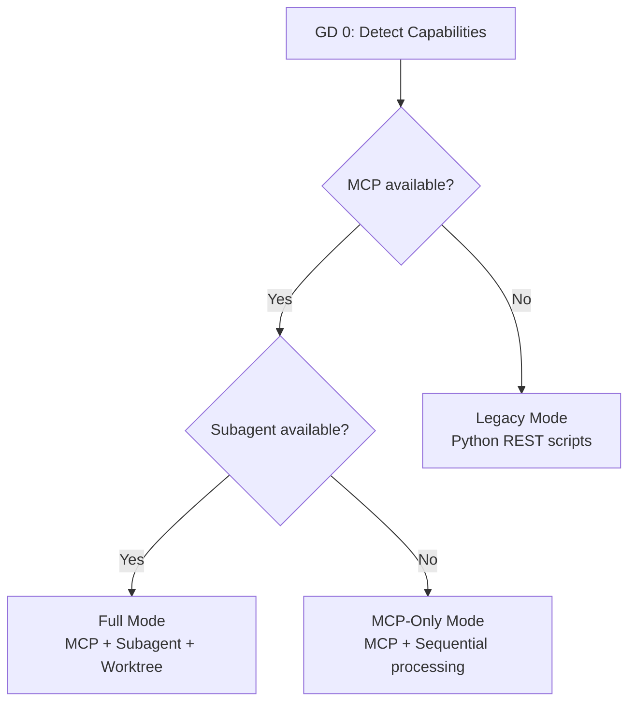
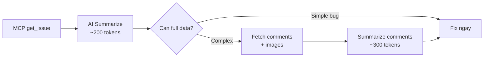

# Refactor Backlog Integration: MCP-First + Subagent Architecture

## Bối cảnh hiện tại

Workflow hiện tại (`[workflows/auto-bugfix.md](workflows/auto-bugfix.md)`) ghi "MCP-First" nhưng thực tế vẫn phụ thuộc nặng vào `[backlog_api.py](skills/backlog-integration/scripts/backlog_api.py)` (~468 dòng Python) làm REST wrapper. Toàn bộ git operations dùng shell script đơn giản (`[git_ops.sh](skills/backlog-integration/scripts/git_ops.sh)`) -- không tận dụng git worktree hay subagent isolation.

---

## Feedback 1: MCP-First -- Loại bỏ dependency vào Python scripts

### Vấn đề

- `backlog_api.py` duplicate chức năng mà `backlog-mcp-server` đã cung cấp: `get_issue`, `get_issue_comments`, `add_issue_comment`, `update_issue`
- Workflow vẫn gọi Python cho những thứ MCP làm được, tốn thêm overhead (spawn process, parse JSON, quản lý config)
- MCP tools trả về structured data trực tiếp cho AI, không cần serialize/deserialize qua CLI

### Thay đổi

**a) Chuyển hoàn toàn sang MCP cho các operations chính:**


| Operation      | Hiện tại (Python)                      | Sau refactor (MCP)                                     |
| -------------- | -------------------------------------- | ------------------------------------------------------ |
| Fetch issue    | `backlog_api.py --action get_issue`    | `mcp_backlog_get_issue(issueIdOrKey)`                  |
| Get comments   | `backlog_api.py --action get_comments` | `mcp_backlog_get_issue_comments(issueIdOrKey)`         |
| Add comment    | `backlog_api.py --action add_comment`  | `mcp_backlog_add_issue_comment(issueIdOrKey, content)` |
| Update status  | `backlog_api.py --action update_issue` | `mcp_backlog_update_issue(issueIdOrKey, statusId)`     |
| Create PR      | `gh pr create` / GitLab API            | `mcp_backlog_add_pull_request(...)` (for Backlog Git)  |
| Get priorities | N/A                                    | `mcp_backlog_get_priorities()`                         |
| List issues    | N/A                                    | `mcp_backlog_get_issues(projectId, statusId)`          |


**b) Giữ lại Python CHỈ cho attachment/image download** (MCP không hỗ trợ binary download):

```python
# backlog_api.py thu gọn chỉ còn ~100 lines:
# - BacklogClient (chỉ giữ download_attachment, download_images)
# - load_config (đọc .brain/backlog.json cho image download)
# - CLI chỉ còn 2 actions: download_images, get_issue_with_images
```

**c) Xoá/deprecate** `mcp_backlog.sh` -- không cần shell wrapper nữa vì MCP server chạy native trong IDE (Cursor đã handle lifecycle).

**d) Cập nhật `[SKILL.md](skills/backlog-integration/SKILL.md)`:** Đổi mode selection logic: MCP là bắt buộc, Python chỉ là supplement cho image download.

### Files cần sửa

- `[skills/backlog-integration/scripts/backlog_api.py](skills/backlog-integration/scripts/backlog_api.py)` -- thu gọn ~70%
- `[workflows/auto-bugfix.md](workflows/auto-bugfix.md)` -- GD 1, GD 5 chuyển hoàn toàn sang MCP calls
- `[skills/backlog-integration/SKILL.md](skills/backlog-integration/SKILL.md)` -- cập nhật mode logic

---

## Feedback 2: Git Worktree + Subagent Development

### Vấn đề

- Hiện tại `git_ops.sh` tạo branch trên working directory chính -- nếu agent đang fix bug A mà user muốn fix bug B, phải stash/switch branch
- Không có isolation giữa các fix tasks
- Không có cơ chế hỏi user "tạo PR hay merge local?"

### Thay đổi

**a) Thay `create_branch` bằng git worktree:**




Cập nhật `git_ops.sh` thêm functions:

- `create_worktree "PROJ-123" "short-desc"` -- tạo `worktrees/bugfix/PROJ-123-short-desc`
- `cleanup_worktree "PROJ-123"` -- xóa worktree sau khi merge/PR done
- Giữ `create_branch` cho backward compat nhưng thêm flag `--worktree`

**b) Subagent development pattern** trong workflow:

- GD 3 (Auto-Fix) triển khai trong worktree riêng, dùng `best-of-n-runner` hoặc `fullstack-developer` subagent
- Subagent nhận context: root cause analysis (GD 2), affected files, worktree path
- Sau khi code xong, hỏi user:

```
"Code fix xong! Anh muốn:
1. Tạo PR → develop (auto push + gh pr create)
2. Merge local → develop (git merge bugfix/...)
3. Review trước (em show diff)"
```

**c) Batch mode cải thiện:** mỗi issue 1 worktree, fix song song nếu independent.

### Files cần sửa

- `[skills/backlog-integration/scripts/git_ops.sh](skills/backlog-integration/scripts/git_ops.sh)` -- thêm worktree functions
- `[workflows/auto-bugfix.md](workflows/auto-bugfix.md)` -- GD 3, GD 4 refactor dùng worktree + subagent

---

## Feedback 3: Multi-Layer Review Subagent

### Vấn đề

- Hiện tại workflow chỉ có 1 bước review đơn giản: confidence gate (HIGH/MEDIUM/LOW)
- Không có code review trước khi push
- Complex bugs cần nhiều góc nhìn (security, performance, compatibility)

### Thay đổi

Thêm **GD 3.5: Multi-Layer Review** vào workflow, chạy SAU khi fix code xong (GD 3) và TRƯỚC khi git operations (GD 4):




**Review layers:**


| Layer            | Subagent             | Focus                                                             | Output                        |
| ---------------- | -------------------- | ----------------------------------------------------------------- | ----------------------------- |
| 1. Code Quality  | `principal-engineer` | Logic correctness, SOLID, code smell, regression risk             | Pass/Warn/Fail + suggestions  |
| 2. Test Adequacy | `qa-engineer`        | Test coverage cho changes, edge cases missed                      | Missing tests + auto-generate |
| 3. Architecture  | `solution-architect` | Cross-module impact, API contract changes, DB migration cần không | Impact report                 |


**Review gate logic:**

- ALL pass -> tiếp tục GD 4
- Co warnings -> tiếp tục + attach warnings vào PR description
- Co failures -> quay lại GD 3 auto-fix lần 2 (max 2 iterations)
- Critical issues -> block, báo user cần manual review

**Config option** trong `.brain/backlog.json`:

```json
{
  "review_layers": ["code_quality", "test_coverage", "architecture"],
  "review_max_iterations": 2,
  "review_skip_for": "LOW"
}
```

### Files cần sửa

- `[workflows/auto-bugfix.md](workflows/auto-bugfix.md)` -- thêm GD 3.5
- `[skills/backlog-integration/SKILL.md](skills/backlog-integration/SKILL.md)` -- document review config

---

## Feedback 4: State Management + Batch Performance

### 4a. State Management

**Vấn đề:** Không có mapping giữa trạng thái Backlog (Open/InProgress/Resolved/Closed) và trạng thái agent (plan/approved/blocked). Agent không biết issue đang ở phase nào nếu bị interrupt.

**Thay đổi:** Tạo file state `.brain/bugfix_state.json` track trạng thái mỗi issue:

```json
{
  "PROJ-123": {
    "backlog_status": "In Progress",
    "agent_phase": "review",
    "agent_status": "in_progress",
    "worktree": "worktrees/bugfix/PROJ-123-cart-fix",
    "branch": "bugfix/PROJ-123-cart-fix",
    "started_at": "2026-03-26T10:00:00Z",
    "updated_at": "2026-03-26T10:15:00Z",
    "analysis": { "confidence": "HIGH", "root_cause_file": "src/cart.js" },
    "pr_url": null,
    "errors": []
  }
}
```

**State mapping:**


| Agent Phase | Agent Status | Backlog Status  | Auto-sync? |
| ----------- | ------------ | --------------- | ---------- |
| fetch       | in_progress  | Open            | No         |
| analyze     | in_progress  | Open            | No         |
| fix         | in_progress  | In Progress (2) | Yes (MCP)  |
| review      | in_progress  | In Progress (2) | No         |
| push        | in_progress  | In Progress (2) | No         |
| pr_created  | approved     | In Progress (2) | No         |
| logged      | completed    | Resolved (3)    | Yes (MCP)  |
| blocked     | blocked      | Open            | No         |


- Agent GD 0 check state file: nếu issue đã có state -> resume từ phase đó thay vì bắt đầu lại
- State auto-sync Backlog status ở 2 điểm: bắt đầu fix (statusId: 2) và hoàn thành (statusId: 3)

### 4b. Batch Performance

**Vấn đề:** Batch nhiều defects -> chậm, tốn token, context overload vì:

- Mỗi issue fetch full data (description + comments + images)
- Tất cả context giữ trong 1 conversation
- Không có prioritization

**Thay đổi:**




**Cụ thể:**

1. **Lightweight triage** (MCP `get_issues`): Fetch chỉ summary + priority + status cho tất cả issues trước -> hiển thị overview -> user confirm order
2. **Subagent isolation**: Mỗi issue chạy trong subagent riêng (dùng `best-of-n-runner` subagent type + worktree) -> context không bị overflow
3. **Lazy loading**: Chỉ fetch full data (comments, images) khi bắt đầu process issue đó -- không fetch hết một lúc
4. **State persistence**: Mỗi issue lưu state riêng trong `bugfix_state.json` -> nếu 1 issue fail, resume được mà không ảnh hưởng issues khác
5. **Concurrency limit**: Max 2-3 issues song song (configurable trong `backlog.json`: `"batch_concurrency": 2`)

**Config addition** cho `.brain/backlog.json`:

```json
{
  "batch_concurrency": 2,
  "batch_priority_order": true,
  "lazy_fetch": true
}
```

### Files cần sửa/tạo

- `[workflows/auto-bugfix.md](workflows/auto-bugfix.md)` -- batch processing logic, state check ở GD 0
- Tạo state management logic trong workflow (không cần script riêng, agent tự đọc/ghi JSON)

---

## So Sanh: Current (REST API) vs Proposed (MCP-First + Subagent)

### Kien truc tong quan




### Uu diem / Nhuoc diem


| Tieu chi             | Current (REST API)                                                       | Proposed (MCP-First)                                              |
| -------------------- | ------------------------------------------------------------------------ | ----------------------------------------------------------------- |
| **Toc do**           | Cham -- spawn Python process moi lan, serialize/deserialize JSON qua CLI | Nhanh 5-10x -- MCP tool call native, data tra ve truc tiep cho AI |
| **Token usage**      | Cao -- output CLI dai, phai parse lai                                    | Thap hon -- MCP tra structured data, AI doc ngay                  |
| **Do phuc tap code** | 468 dong Python + shell scripts, nhieu lop trung gian                    | ~100 dong Python (chi image), logic nam trong workflow            |
| **Dependency**       | Python 3.8+, requests lib, shell scripts                                 | MCP server (npm package), Python chi cho image                    |
| **Kha nang mo rong** | Phai viet them code Python cho moi feature moi                           | MCP cung cap san nhieu tools (PR, project, priorities...)         |
| **Parallel/Batch**   | Sequential, 1 conversation giu tat ca context                            | Worktree + subagent isolation, parallel processing                |
| **State management** | Khong co -- mat state khi interrupt                                      | `bugfix_state.json` -- resume duoc                                |
| **Code review**      | Chi co confidence gate don gian                                          | Multi-layer review 3 subagent                                     |
| **Error recovery**   | Retry don gian, khong nho phase                                          | State-based resume, retry tu phase bi fail                        |
| **Compatibility**    | Chay duoc tren moi AI tool (chi can shell)                               | **Can MCP support** -- khong phai tool nao cung co                |
| **Offline**          | Khong (can API)                                                          | Khong (can API + MCP server)                                      |
| **Learning curve**   | Thap -- shell + Python quen thuoc                                        | Trung binh -- can hieu MCP protocol, subagent pattern             |
| **Debug**            | De -- doc log Python, curl test duoc                                     | Kho hon -- MCP la black box, log nam trong IDE                    |


### Nhan dinh

**Current approach tot khi:**

- AI tool khong ho tro MCP (VD: ChatGPT, Claude web, co AI tools)
- Can debug/test API calls bang tay (curl, Postman)
- Team khong quen MCP ecosystem
- Project don gian, 1-2 issues/lan

**Proposed approach tot khi:**

- Dung Cursor, Windsurf, Cline, Antigravity (co MCP support)
- Batch processing nhieu issues
- Can do chinh xac cao (multi-layer review)
- Can resume sau khi bi interrupt
- Team da familiar voi MCP

---

## Graceful Degradation: Khi AI Tool Khong Co Subagent

Khong phai AI tool nao cung ho tro subagent (VD: ChatGPT, Claude web, Copilot Chat, mot so Cline config). Workflow can chay duoc tren ca 2 mode.

### Phat hien capability

Workflow GD 0 them buoc detect:

```
AI Tool Capability Detection:
1. Check MCP available? → co/khong
2. Check subagent available? → co/khong
3. Check git worktree support? → co/khong

→ Set execution_mode:
  - "full": MCP + subagent + worktree (Cursor, Antigravity)
  - "mcp_only": MCP + single-thread (Cline, Windsurf basic)
  - "legacy": Python REST + single-thread (ChatGPT, Claude web)
```

### Fallback matrix




| Feature        | Full Mode               | MCP-Only Mode                      | Legacy Mode                           |
| -------------- | ----------------------- | ---------------------------------- | ------------------------------------- |
| Fetch issue    | MCP `get_issue`         | MCP `get_issue`                    | `backlog_api.py --action get_issue`   |
| Add comment    | MCP `add_issue_comment` | MCP `add_issue_comment`            | `backlog_api.py --action add_comment` |
| Image download | Python (luon)           | Python (luon)                      | Python (luon)                         |
| Git branching  | Worktree isolation      | `git checkout -b` (standard)       | `git checkout -b` (standard)          |
| Code fix       | Subagent trong worktree | Agent tu fix (cung conversation)   | Agent tu fix (cung conversation)      |
| Review         | 3 subagent parallel     | Agent tu review 3 layer sequential | Confidence gate don gian              |
| Batch          | Parallel subagents      | Sequential loop                    | Sequential loop                       |
| State          | `bugfix_state.json`     | `bugfix_state.json`                | Khong co                              |


### Anh huong khi khong co subagent

**Context window:** Khong co subagent nghia la moi thu chay trong 1 conversation. Voi bug phuc tap (description dai + 20 comments + nhieu files), context se day nhanh. Giai phap:

- Summarize issue data truoc khi luu vao context (chi giu key info)
- Batch mode: xu ly tung issue, clear context giua cac issues
- Review: chay sequential thay vi parallel, nhung van giu 3 layers

**Token cost:** Subagent co context rieng, nho hon. Khong co subagent thi tat ca context nam trong 1 conversation lon. Uoc tinh tang ~30-50% token cho complex bugs.

**Do chinh xac review:** Subagent review co loi the la "fresh eyes" -- khong bi bias boi context fix truoc do. Khong co subagent thi agent vua fix vua review, co the tu confirm sai. Giai phap:

- Bat agent "doi vai" (role-play) khi review: "Bay gio ban la senior reviewer, chi ra loi trong code nay"
- Yeu cau agent list ra checklist truoc, roi check tung item

### Workflow config

Trong `.brain/backlog.json`:

```json
{
  "execution_mode": "auto",
  "fallback_order": ["full", "mcp_only", "legacy"],
  "review_mode": "sequential",
  "batch_mode": "sequential"
}
```

`"auto"` = tu detect capabilities va chon mode phu hop.

---

## Token Optimization Strategies

### Van de hien tai

Workflow bugfix tieu hao nhieu token vi:

- Fetch full issue data (description co the rat dai)
- Comment history (20+ comments, nhieu noise)
- Image descriptions (AI mo ta tung anh)
- Code search results (grep tra ve nhieu ket qua)
- Template population (template dai, nhieu placeholder)
- Batch mode: nhan x N issues

### Chien luoc toi uu

#### 1. MCP Response Optimization

MCP server da ho tro `OPTIMIZE_RESPONSE=1` va `MAX_TOKENS=10000`. Tang cuong:

```json
{
  "env": {
    "OPTIMIZE_RESPONSE": "1",
    "MAX_TOKENS": "5000",
    "ENABLE_TOOLSETS": "issue"
  }
}
```

- Chi enable toolsets can thiet (issue) thay vi tat ca (space,project,issue,git)
- Giam `MAX_TOKENS` tu 10000 xuong 5000 -- du cho hau het issues
- MCP server tu truncate/summarize response

#### 2. Lazy Loading + Summarization Pipeline




- **Phase 1:** Fetch chi summary + description (khong comments, khong attachments)
- **Phase 2:** AI doc description, quyet dinh can them info khong
- **Phase 3:** Chi fetch comments/images khi can thiet
- Moi buoc summarize truoc khi luu context

#### 3. Context Pruning

Sau moi giai doan, prune context khong can nua:


| Sau GD          | Prune                              | Giu                                    |
| --------------- | ---------------------------------- | -------------------------------------- |
| GD 1 (Fetch)    | Raw API response                   | Summarized issue info (~200 tokens)    |
| GD 2 (Analyze)  | Search results, full file contents | Root cause summary (~150 tokens)       |
| GD 3 (Fix)      | Diff details                       | Changed files list (~100 tokens)       |
| GD 3.5 (Review) | Review details                     | Pass/Fail + key warnings (~100 tokens) |


Cach thuc hien:

- Agent tu ghi "summary note" sau moi giai doan
- Reference summary note o cac giai doan sau thay vi raw data
- Voi subagent: moi subagent chi nhan summary, khong nhan full history

#### 4. Template Token Reduction

Templates hien tai dung nhieu placeholder va boilerplate. Toi uu:

- **Fix comment:** Giam tu 6 sections xuong 4 core sections cho simple bugs (skip cross-project + estimate khi khong can)
- **Client report:** Chi generate khi user yeu cau (`report_auto: false` trong config)
- **PR description:** Dung short format cho simple bugs, full format cho complex

Config:

```json
{
  "report_auto": false,
  "comment_format": "auto",
  "pr_format": "auto"
}
```

`"auto"` = simple bugs dung short format, complex dung full format.

#### 5. Batch Token Budget

Dat token budget cho moi issue trong batch:

```json
{
  "batch_token_budget": {
    "triage_per_issue": 500,
    "analysis_per_issue": 2000,
    "fix_per_issue": 3000,
    "review_per_issue": 1500,
    "total_max": 50000
  }
}
```

- Truoc khi bat dau batch, uoc luong total tokens
- Neu vuot budget, hoi user: "Batch 5 issues uoc tinh ~40k tokens. Tiep tuc?"
- Priority issues duoc allocate nhieu token hon

#### 6. Caching (cho batch/repeat runs)

- Luu issue summary vao `bugfix_state.json` -- khong fetch lai neu da co
- Cache project context (`.brain/brain.json`) -- khong scan lai codebase moi lan
- Cache MCP responses (TTL 5 phut) cho issues khong thay doi

### Uoc tinh token savings


| Scenario           | Hien tai     | Sau optimize | Giam |
| ------------------ | ------------ | ------------ | ---- |
| Single simple bug  | ~8k tokens   | ~3k tokens   | ~62% |
| Single complex bug | ~20k tokens  | ~10k tokens  | ~50% |
| Batch 5 bugs       | ~100k tokens | ~35k tokens  | ~65% |


---

## Tom tat thay doi files


| File                                                | Thay doi                                                                                                |
| --------------------------------------------------- | ------------------------------------------------------------------------------------------------------- |
| `workflows/auto-bugfix.md`                          | Refactor lon: MCP-first, worktree, review layer, state, batch, capability detection, token optimization |
| `skills/backlog-integration/scripts/backlog_api.py` | Thu gon ~70%, chi giu image download                                                                    |
| `skills/backlog-integration/scripts/git_ops.sh`     | Them worktree functions                                                                                 |
| `skills/backlog-integration/SKILL.md`               | Update mode logic, document new features, execution modes, token config                                 |
| `skills/backlog-integration/scripts/mcp_backlog.sh` | Deprecate/xoa (MCP chay native trong IDE)                                                               |


